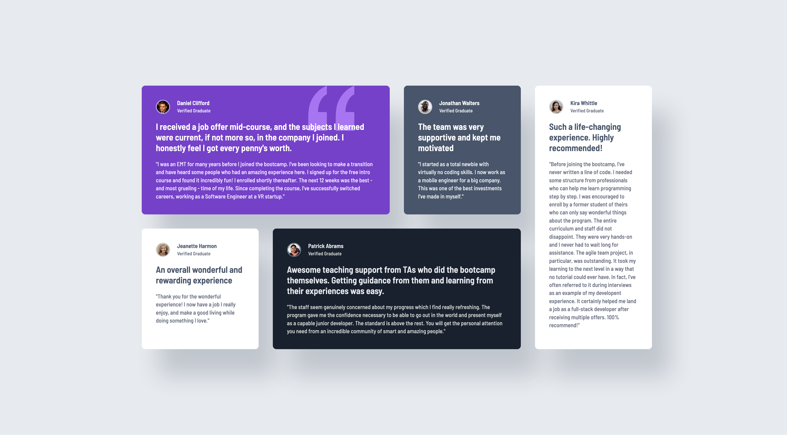

# Testimonials Grid Section

A responsive testimonials grid showcasing student testimonials in an elegant multi-column layout. Built as part of the [Frontend Mentor](https://www.frontendmentor.io/) Building Responsive Layouts learning path.

## 🎯 Overview

This project demonstrates a testimonials grid section featuring five student testimonials. The layout adapts seamlessly from a single-column mobile view to a sophisticated multi-column grid on desktop screens.

### Solution



### Links

- Solution URL: [GitHub Repository](https://github.com/hakan-kemal/testimonials-grid-section)
- Live Site URL: [Netlify Deployment](https://testimonials-grid-section-hk.netlify.app/)

## 🛠 My Process

### Built With

- **HTML5** - Semantic markup
- **CSS3** - Modern styling techniques
  - CSS Custom Properties (CSS Variables)
  - CSS Grid Layout
  - Flexbox Layout
  - Mobile-first workflow
- **Google Fonts** - [Barlow Semi Condensed](https://fonts.googleapis.com/css2?family=Barlow+Semi+Condensed:wght@500;600&display=swap)

### What I Learned

This project reinforced several key concepts:

**Advanced CSS Grid Layouts:** Created a complex testimonial grid using CSS Grid with precise positioning:

```css
.grid-container {
  display: grid;
  grid-template-columns: repeat(4, 1fr);
  gap: 1.5rem;
}

.item-a {
  grid-column: 1 / 3;
}
```

**CSS Custom Properties:** Organized design tokens using CSS variables for maintainability:

```css
:root {
  --color-moderate-violet: hsl(263, 55%, 52%);
  --color-very-dark-grayish-blue: hsl(217, 19%, 35%);
  --color-very-dark-blackish-blue: hsl(219, 29%, 14%);
  --color-white: hsl(0, 0%, 100%);
}
```

**Responsive Design:** Implemented mobile-first approach with seamless breakpoints:

```css
@media (min-width: 48rem) {
  .grid-container {
    display: grid;
    grid-template-columns: repeat(4, 1fr);
  }
}
```

### Continued Development

Areas I want to focus on in future projects:

- Mastering more complex CSS Grid patterns and asymmetric layouts
- Exploring CSS subgrid for nested grid layouts
- Learning JavaScript fundamentals to add interactivity
- Implementing CSS animations for card hover effects
- Deepening accessibility knowledge with ARIA patterns

### Useful Resources

- [MDN Web Docs - CSS Grid Layout](https://developer.mozilla.org/en-US/docs/Web/CSS/CSS_grid_layout) - Comprehensive guide on CSS Grid
- [CSS-Tricks - A Complete Guide to Grid](https://css-tricks.com/snippets/css/complete-guide-grid/) - Excellent visual reference for Grid properties
- [web.dev - CSS Custom Properties](https://web.dev/learn/css/custom-properties) - Understanding CSS variables

## 👤 Author

- Frontend Mentor - [@hakan-kemal](https://www.frontendmentor.io/profile/hakan-kemal)
- GitHub - [@hakan-kemal](https://github.com/hakan-kemal)

## 🙏 Acknowledgments

Thanks to Frontend Mentor for providing this challenge and the design specifications.
